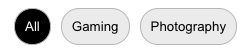

# React Tab Selector
## Getting started

1. Inside your project, run `npm install --save react-tab-selector`.

2. Use the component:

```jsx
import { TabSelector } from 'react-tab-selector';


const MyComponent = () => {
  return <div>
    <TabSelector
      tabs={[
        {
          title: 'All',
          onClick: () => alert('Clicked All')
        },
        {
          title: 'Gaming',
          onClick: () => alert('Clicked Gaming')
        },
        {
          title: 'Photography',
          onClick: () => alert('Clicked Photography')
        }
      ]}
    />
  </div>
}
```

### Component props
| Prop   | Description                                                                                                                   |
|--------|-------------------------------------------------------------------------------------------------------------------------------|
| `tabs` | Takes an array of objects with the value pairs `title` and `onClick`.<br/> For example: `[{ title: 'All', onClick: myCallback }]`  |


### Visual example

Here's what this example would look like:



## Steps to publish a new version to the NPM registry

1. Run `npm run build`.
2. Verify files have changed with `git status`.
3. Run `npm publish`.
